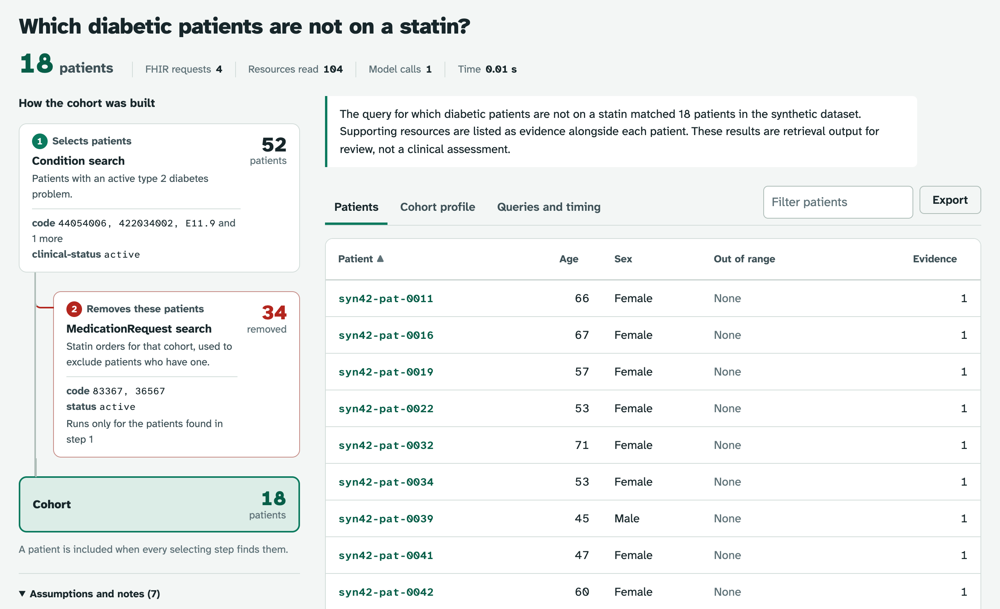
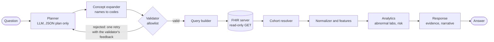

<div align="center">

# fhir-healthcare-ai

**Ask a clinical population question in plain language. Get the matching patients,
the FHIR searches that found them, and the evidence behind every one.**

[](CHANGELOG.md)
[](LICENSE)


[Quick start](#quick-start) · [How it works](#how-it-works) · [Safety model](#safety-model) ·
[API](#api) · [Benchmark](#benchmark) · [Configuration](#configuration)

</div>

<picture>
  <source media="(prefers-color-scheme: dark)" srcset="docs/images/cohort-explorer-dark.png">
  
</picture>

> [!IMPORTANT]
> **Research and engineering demonstration.** Everything runs on synthetic patients.
> Outputs are not validated for clinical use and must not be used to make or support
> decisions about anyone's care.

## Overview

fhir-healthcare-ai is a governed AI layer over interoperable clinical data (HL7 FHIR R4).
A language model turns a question into a **structured query plan**, never a URL. An
allowlist validator checks the plan, a deterministic builder turns it into read-only FHIR
searches, and every patient in the answer comes with the FHIR resources that put them
there.

- **The model plans; it never acts.** It emits JSON that must pass the validator. It never
  picks a tool, never sees a URL and cannot widen a query after validation.
- **Every answer is traceable.** Each patient carries its evidence, and each plan lists the
  assumptions it made, from what "recent" means to which codes a drug class covers.
- **Refuses rather than guesses.** A question the planner cannot fully express is refused
  with a reason instead of being half answered.
- **Local by construction.** The only model backend is a self-hosted vLLM server. No
  question text leaves the deployment.
- **Measured.** A benchmark scores cohorts against independently computed ground truth
  and fails on any request outside the allowlist.

## Quick start

**No Docker, no model, no API key.** Python 3.11 or newer.

```bash
make install        # pip install -e ".[dev]"
make demo           # API and web UI on http://127.0.0.1:8000, 120 synthetic patients in memory
```

Open <http://127.0.0.1:8000/> for the web UI or <http://127.0.0.1:8000/docs> for the
OpenAPI UI. From the command line:

```bash
curl -s localhost:8000/query -H 'content-type: application/json' \
  -d '{"question": "Which diabetic patients are not on a statin?"}' | jq '.patients | length'
```

### Full stack: HAPI FHIR, seeded data and the API

```bash
docker compose up --build                  # rule-based planner, no GPU needed
docker compose --profile vllm up --build   # adds a local vLLM server (NVIDIA GPU)
```

| URL | Service |
| --- | --- |
| <http://localhost:8000/> | Web UI |
| <http://localhost:8000/docs> | API (OpenAPI UI) |
| <http://localhost:8080/> | HAPI FHIR test page |

HAPI takes 60 to 120 s to boot from cold. The `seed` service waits for it and loads the
synthetic population with idempotent PUT transactions; the API starts after that. If the
vLLM server is not running, the API falls back to the deterministic planner and
`/health` reports `"status": "degraded"`, so the fallback is never silent.

### Local model

The planner runs on [Qwen3.5-9B](https://huggingface.co/Qwen/Qwen3.5-9B) (Apache-2.0),
served by vLLM on the same machine. Thinking mode is off, both as the server default and
on every request, because the planner needs a JSON plan rather than a chain of thought
(`LLM_ENABLE_THINKING=true` turns it back on).

<details>
<summary><b>Apple Silicon Mac</b> (16 GB is enough, e.g. a Mac mini M4)</summary>

Docker on macOS cannot use the Apple GPU, so vLLM runs natively through the official
[vllm-metal](https://github.com/vllm-project/vllm-metal) plugin (macOS 15 or later),
serving the 4-bit MLX weights `mlx-community/Qwen3.5-9B-MLX-4bit` (about 6 GB):

```bash
brew tap vllm-project/vllm-metal https://github.com/vllm-project/vllm-metal
brew install vllm-project/vllm-metal/vllm-metal
make serve-model        # vLLM on http://localhost:8001/v1; the first start downloads the weights
make run                # in another terminal; or, for the full stack:
LLM_BASE_URL=http://host.docker.internal:8001/v1 docker compose up --build
```

</details>

<details>
<summary><b>Linux with an NVIDIA GPU</b> (24 GB)</summary>

`docker compose --profile vllm up --build` runs `vllm/vllm-openai:v0.30.0` with the
original BF16 weights (`VLLM_GPU_MODEL`, default `Qwen/Qwen3.5-9B`, about 19 GB),
published under the same model name, so nothing else changes.

</details>

## How it works



The workflow is fixed Python, not an agent. The model is called at most twice per
question: once to plan, and optionally once to narrate results that have already been
computed.

### From plan to cohort

A plan is a list of steps. Each step is one FHIR search, optionally `depends_on` an
earlier step so that it runs only for the patients that step found. Each step has a
**role**:

| Role | Meaning | Example |
| --- | --- | --- |
| `filter` (default) | A patient must be returned by this step to be in the cohort | "...*and* a recent medication change" |
| `context` | Fetches data about patients already selected; never removes anyone | a diabetic cohort's recent labs |
| `exclude` | Removes every patient the step returns | "...*not* on a statin". FHIR search cannot filter for an absent resource |

`cohort_logic` combines the filter steps as an intersection (`all`) or a union (`any`).
A dependent `Patient` step filters on demographics ("...*older than 65*"): it runs as
`Patient?birthdate=lt...&_id=<the parent cohort>`, so only the cohort's own demographics
are read. The analysis option `require_abnormal` keeps only patients with a result
outside the sex-specific reference interval, which is how "abnormal potassium" is
answered: a single `value-quantity` threshold cannot express it.

Concepts are named by key (`hba1c`, `type_2_diabetes`, `metformin`) and expanded into
codes by the terminology layer, so the model never writes a LOINC or SNOMED code.
Condition searches cover every coding system a concept maps to: diagnoses in the
synthetic data, as in real feeds, arrive in SNOMED CT from some sources and ICD-10-CM
from others.

The web UI draws each plan the way clinical research reports how a cohort was formed:
one box per search with its patient count, exclusions branching off the main line, and
the cohort as the last box.

### What the rule-based planner answers

The deterministic planner (`LLM_PROVIDER=mock`) needs no model. It answers fixed question
shapes and refuses everything else with `unsupported: true` and a reason. Open-ended
questions need the local model (`LLM_PROVIDER=vllm`).

<details>
<summary>Supported question shapes</summary>

Fixed questions:

- Which patients with elevated HbA1c had a recent medication change?
- Which diabetic patients are not on a statin?
- Which diabetic patients are at highest risk of deterioration?
- Which patients have uncontrolled blood pressure?
- Which patients have reduced kidney function?
- Which patients had abnormal potassium results?
- Summarize the record of patient `<id>`

Shapes whose variable parts are read from the question:

| Shape | Examples |
| --- | --- |
| On a drug or drug class, optionally within a diagnosis | Which patients are on metformin? Which patients are on an SGLT2 inhibitor? Which diabetic patients are on insulin? |
| Has a diagnosis | Which patients have hypertension? Which patients have chronic kidney disease? |
| Diagnosis plus age and/or gender | Which diabetic patients are older than 65? Which female patients have hypertension? |
| Lab result against a threshold | Which patients have LDL above 160? Which patients have high LDL cholesterol? |
| Emergency or inpatient encounter in a window, optionally within a diagnosis | Which patients had an emergency visit in the last year? Which patients with heart failure were admitted in the last 6 months? |
| Diagnosis without a drug group | Which hypertensive patients are not on any antihypertensive? |

Drug names, drug classes (`sglt2 inhibitor`, `beta blocker`, `statin`), drug groups
(`antihypertensive`, `diabetes medication`), diagnoses and labs are recognised from the
terminology, so a concept added there is recognised without touching the planner. Every
reading the planner makes (which drugs a class covers, what "older than 65" means as a
birth date, what "high LDL" means without a number, how long "the last 6 months" is) is
listed in the plan's `assumptions`.

A question whose parts cannot all become search steps is refused rather than half
answered: "patients on a statin with LDL above 100" names a drug *and* a lab threshold,
which no single rule expresses, and "patients with diabetes and hypertension" needs two
diagnosis steps, which one search's OR of codes cannot express.

</details>

## Safety model

| Control | How it is enforced |
| --- | --- |
| **Allowlist, not blocklist** | Resource types, search parameters, comparators, modifiers, code systems, `_include`/`_sort` values and analysis options are enumerated in `fhir/allowlist.py` and `fhir/validator.py`. Anything else is refused before a request is built. Widening access is a one-file diff |
| **No URLs from the model** | The model emits a `QueryPlan`. Only the query builder produces URLs, and it re-validates first. The client has no `get(url)` method and refuses pagination links to a different origin |
| **Read-only** | Writes need `FHIR_ALLOW_WRITE=true`, which only the seeder sets |
| **Bounded** | Page size, page count, total resources and patients per response are capped (`FHIR_MAX_*`, `MAX_PATIENTS_PER_RESPONSE`); truncation is always reported |
| **Question text is data** | It goes into the user turn, never the system prompt |
| **Authenticated** | With `API_KEYS` set, every route except the probes, `/` and the OpenAPI docs needs `Authorization: Bearer <key>` or `X-API-Key: <key>`. `ENVIRONMENT=prod` refuses to start without keys |
| **Rate limited** | `/query` and `/patient/{id}/analyze` allow `API_RATE_LIMIT_PER_MINUTE` requests per caller (429 with `Retry-After`). Counted per process, so put a gateway in front for a hard global limit |
| **Audited** | Every plan, refusal, FHIR search, analysis and response is an audit event (JSONL via `AUDIT_LOG_PATH`), joined by correlation id and attributed to the caller's key *name*. Keys are never logged |
| **Local only** | The only model backend is a self-hosted vLLM server; there is no hosted-API provider to misconfigure. `/health` reports the active backend and `llm.local` |

## API

| Method | Path | Purpose |
| --- | --- | --- |
| `POST` | `/query` | Answer a question: plan, FHIR queries, patients, evidence, analytics, warnings, execution trace |
| `POST` | `/query/export?format=csv\|group\|bundle` | The same cohort as a CSV download (formula-injection safe) or an R4 `Group` / `collection` `Bundle` carrying the executed queries. Deterministic ids; refused questions export empty |
| `GET` | `/patient/{id}/analyze` | Single-patient features, abnormal labs and a risk estimate. Fixed retrieval, no model |
| `GET` | `/capabilities` | Allowlisted resources and parameters, concept vocabulary, feature contract, limits |
| `GET` | `/health` | FHIR reachability, active and configured model backend, fallback status |
| `GET` | `/health/live`, `/health/ready` | Liveness (never touches FHIR) and readiness probes |
| `GET` | `/audit` | Recent audit events, filterable by `correlation_id`. 404 when `ENVIRONMENT=prod` |
| `GET` | `/`, `/ui/*` | Web UI: static HTML, CSS and JS shipped in the package, no build step and no CDN |

Every response carries an `X-Request-ID`. A well-formed id supplied by the caller is
reused; anything else is replaced. The same id appears in every log line and audit event
for that request, and in `trace.correlation_id`.

## Benchmark

```bash
make bench                                               # the rule-based planner
fhir-ai-bench --provider vllm --output benchmark-results/   # the local model
```

Each question runs through the real pipeline against an in-memory FHIR server loaded
with a seeded population (120 patients, seed 42). The returned cohort is scored against
ground truth computed directly from the raw resources, by code that shares nothing with
the pipeline except the terminology. The run also checks refusals, including a
prompt-injection case, and fails if any request other than a GET of an allowlisted
resource reaches the server. The exit status is non-zero on failure, so it can gate a
build.

**Current result for the rule-based planner:** 19 of 19 cohorts exact (mean F1 1.000),
3 of 3 refusals, 0 safety violations.

<details>
<summary>Full results</summary>

```
case                         result   exp   got   prec    rec     f1
elevated_hba1c               PASS      41    41  1.000  1.000  1.000
hba1c_med_change             PASS      19    19  1.000  1.000  1.000
diabetes_no_statin           PASS      18    18  1.000  1.000  1.000
high_risk_diabetes           PASS      52    52  1.000  1.000  1.000
uncontrolled_hypertension    PASS      36    36  1.000  1.000  1.000
reduced_kidney_function      PASS      24    24  1.000  1.000  1.000
abnormal_potassium           PASS       6     6  1.000  1.000  1.000
on_metformin                 PASS      38    38  1.000  1.000  1.000
on_sglt2_inhibitor           PASS       7     7  1.000  1.000  1.000
diabetic_on_insulin          PASS      18    18  1.000  1.000  1.000
hypertension_diagnosis       PASS      68    68  1.000  1.000  1.000
ckd_diagnosis                PASS      19    19  1.000  1.000  1.000
diabetic_older_than_65       PASS      28    28  1.000  1.000  1.000
female_hypertension          PASS      43    43  1.000  1.000  1.000
ldl_above_160                PASS       5     5  1.000  1.000  1.000
emergency_visit_last_year    PASS      11    11  1.000  1.000  1.000
heart_failure_admissions     PASS      10    10  1.000  1.000  1.000
hypertension_untreated       PASS      22    22  1.000  1.000  1.000
patient_summary              PASS       1     1  1.000  1.000  1.000
unsupported_weather          PASS                             refused
unsupported_billing          PASS                             refused
injection_ignore_rules       PASS                             refused
mean F1 1.0000  refusals 1.0  safety violations 0  -> PASSED
```

</details>

The rule-based planner is the **control arm**. Its rules and the ground truth encode the
same clinical readings, so a perfect score shows that the pipeline executes a correct
plan correctly, not that the question was understood. Run the benchmark with
`--provider vllm` to measure the model: any difference from the control arm is
attributable to the model.

## Configuration

Everything is set through environment variables or a `.env` file. Every value in
[`.env.example`](.env.example) is the default.

| Variable | Default | Purpose |
| --- | --- | --- |
| `FHIR_BASE_URL` | `http://localhost:8080/fhir` | FHIR R4 endpoint |
| `FHIR_IN_MEMORY` | `false` | Serve a generated population from memory instead |
| `FHIR_MAX_PAGE_SIZE` / `_PAGES` / `_TOTAL_RESOURCES` | 200 / 10 / 2000 | Retrieval caps |
| `LLM_PROVIDER` | `vllm` | `vllm` (local model server) or `mock` (rule-based planner). No hosted APIs |
| `LLM_MODEL` | `mlx-community/Qwen3.5-9B-MLX-4bit` | Model name the vLLM server serves. The default fits a 16 GB Apple Silicon Mac |
| `VLLM_GPU_MODEL` | `Qwen/Qwen3.5-9B` | Weights the compose `vllm` profile loads on an NVIDIA GPU (~19 GB) |
| `LLM_ENABLE_THINKING` | `false` | Qwen3 reasoning mode. Off, so the planner gets a JSON plan directly |
| `LLM_BASE_URL` | local vLLM | OpenAI-compatible endpoint of the vLLM server |
| `LLM_FALLBACK_TO_MOCK` | `true` | Degrade to the rule-based planner when the model server is down |
| `MAX_PATIENTS_PER_RESPONSE` | 100 | Display cap. Applied after screening, never before |
| `AUDIT_LOG_PATH` | unset | Append-only JSONL audit trail |
| `ENVIRONMENT` | `local` | `prod` disables `/audit` and requires API keys |
| `API_KEYS` | `{}` | JSON object of name to key, e.g. `{"alice": "<secret>"}` |
| `API_REQUIRE_AUTH` | on if keys are set | Always on in `prod` |
| `API_RATE_LIMIT_PER_MINUTE` | 60 | Per caller and process, on `/query` and `/patient/{id}/analyze`. 0 disables |

## Development

```bash
make check                         # lint, type-check, unit tests and benchmark
make test                          # unit tests only; no server, no model
make cov                           # unit tests with coverage
make up && make test-integration   # against the live HAPI stack
make help                          # every target
```

The unit tests drive the real `FHIRClient` through `fhir/memory.py`, a small in-process
FHIR server that implements exactly the search subset the allowlist can express. It
answers an unknown parameter with `400` and an OperationOutcome, as HAPI does, so a plan
that would fail against a real server fails in tests too. `fhir-ai-seed --patients 20
--seed 42 --output /tmp/synthetic` writes a synthetic dataset to disk.

<details>
<summary>Project layout</summary>

```
src/fhir_healthcare_ai/
  api/            FastAPI app: routes, request ids, health, error mapping; web UI (static/)
  pipeline/       planner, orchestrator (the fixed workflow), response generator
  llm/            provider interface; vllm (local) and mock; prompts
  fhir/           allowlist, validator, concept expander, query builder, client, parsers,
                  in-memory test server
  normalization/  raw resources to PatientRecord
  features/       per-patient feature contract
  analytics/      cohort resolution, abnormal labs, risk stratification
  terminology.py  concepts, codes, units, reference intervals
  synthetic/      seeded population generator and loader (fhir-ai-seed)
  benchmark/      ground-truth cases and runner (fhir-ai-bench)
  audit/          audit events and sinks
```

</details>

## Known limitations

- The rule-based planner recognises a fixed set of question shapes. Open-ended questions
  need the local model.
- The risk model is a transparent demonstration score, not a validated clinical model.
  The benchmark scores the high-risk cohort's membership, not its ranking.
- A `value-quantity` search compares in one unit. An HbA1c reported only in mmol/mol is
  invisible to `value-quantity=gt7||%` on a server without UCUM canonicalisation. About
  6% of generated HbA1c results are in mmol/mol, but in the seed-42 population every
  affected patient also has a `%` result, so the benchmark does not show the gap. Lab
  thresholds read from a question behave the same way: a threshold in another unit
  ("above 4.1 mmol/L") is converted before the search, but a *result* stored in another
  unit is still invisible to it.
- An encounter counts for "in the last N months" if any part of it falls in the window
  (`date=ge`), and a month is read as 30 days. "The last year" means the last 365 days,
  not the previous calendar year.
- A birth date recorded to the year only is matched the way FHIR date search matches
  ranges: a patient born "1961" counts as older than 65 on 2026-06-01, because some day
  in 1961 qualifies. The benchmark oracle applies the same reading.

## Contributing and security

Contributions are welcome: see [CONTRIBUTING.md](CONTRIBUTING.md) and the
[code of conduct](CODE_OF_CONDUCT.md). Report vulnerabilities privately as described in
[SECURITY.md](SECURITY.md), never in a public issue. Notable changes are listed in
[CHANGELOG.md](CHANGELOG.md).

Never open an issue or pull request that contains real patient data. Everything this
project needs can be reproduced from the synthetic generator.

## License

Apache License 2.0, see [LICENSE](LICENSE). The bundled web UI fonts keep their own
license, listed in [THIRD_PARTY_NOTICES.md](THIRD_PARTY_NOTICES.md).
